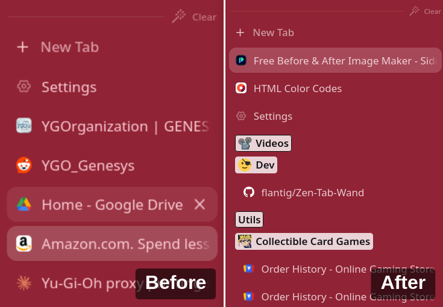
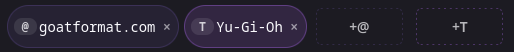
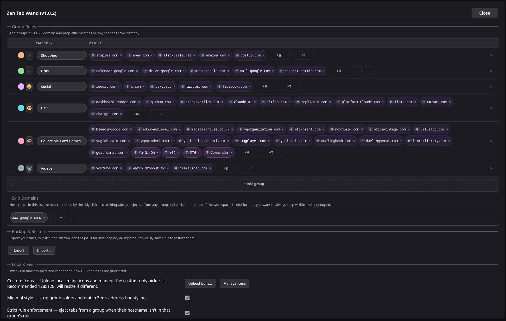
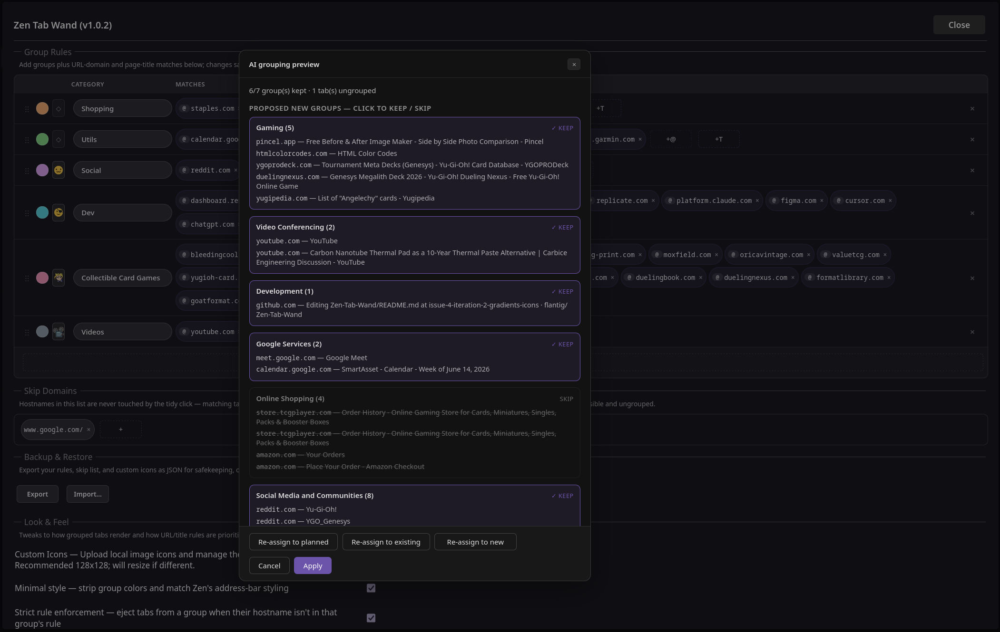
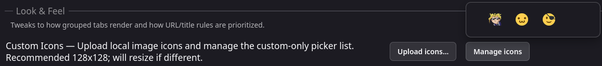

# Zen Tab Wand

A one-click tab tidier for [Zen Browser](https://zen-browser.app), installed via the [Sine](https://github.com/CosmoCreeper/Sine) mod loader. Click the wand in your toolbar, and your open tabs get sorted into groups.



## How it works

Two passes:

1. **Rules first.** You define groups in settings — e.g. `Shopping` matches domains like `amazon.com`, or title keywords like `invoice`. Every open tab whose URL/title matches a rule moves into the corresponding group.
2. **AI fallback for the rest.** Tabs the rules don't cover can be sent to a local AI engine that figures out where they belong. The AI is **optional and off by default**; you choose whether to enable it.

There's no cloud component. The AI runs on your machine via [Ollama](https://ollama.com) (recommended) or Firefox's bundled ML engine (limited).

### How I reccomend using it

If I have no groups and a lot of tabs, I'll run the ai model to create a good approximation of groups. Once I have a solid foundation to work from, I can turn the ai off and add individual domains to rules manually. I find this method to be the most efficient use of ai while being most practical and precise.

## Installing

In Zen → Sine → Marketplace, search for "Zen Tab Wand" and install. Or sideload by dropping the source into your Sine mods folder.

After install, a wand icon appears in your toolbar's workspace separator. Left-click the icon to sort.


## Quick start

1. Open **Settings → Zen Tab Wand**.
2. Edit the **Group Rules** table to your liking. Each group needs a name and one or more match chips: `@` chips for domains (e.g. `github.com`) and `T` chips for page-title keywords. Colors, gradients, and icons are optional.

3. Click the **wand button** in the toolbar. Your matching tabs are sorted instantly.
4. (Optional) Pick an **AI engine** for tabs the rules don't cover — see below.



Fresh installs start with a small set of editable default groups: Calendar, AI Tools, Dev, Shopping, Social, Music, and Search. Existing user rules are not overwritten when these defaults change.

## Growing rules from the tab right-click

Right-click any tab → **Add "host" to Rule…** — a submenu pops up listing every current rule. Pick one and the tab's hostname is appended to that rule's domain list. Rules already containing this hostname are listed with a ✓ and disabled. The bottom of the submenu also has a **Skip** entry that adds the hostname to the Skip Domains list.

The tab doesn't move — only the rule grows. Click the wand afterwards to actually sort tabs based on the new rule.


## AI engines

| Engine | What it does | Setup |
|---|---|---|
| **Off** | Rules only. Tabs without a matching rule stay where they are. | — |
| **Local** | Firefox's bundled tab-embedding model. Assigns tabs to existing groups and — as of v1.0.2 — can also invent new groups (Auto-add / Transient / Fresh categories). Names are derived from hostnames, intent labels, or extracted keywords. No setup. | None — built in. |
| **Ollama** | A local Ollama daemon. Assigns tabs into existing groups and invents new ones, with a merge pass and an optional interactive **Plan Mode** where you preview the plan before applying. | Install [Ollama](https://ollama.com), then `ollama pull qwen2.5:1.5b` (or a bigger model if you have the VRAM). |

The first time you pick **Local** or **Ollama** in settings, a one-shot warning modal explains the resource cost (CPU/RAM for Local, VRAM for Ollama) and asks you to acknowledge before the engine is allowed to run.

Both engines fetch a small page-context snippet (`og:type`, `og:site_name`, first `<h1>`, `<meta name="description">`) for each unmatched tab to classify on more than just the URL.

For Ollama, the default model is `qwen2.5:1.5b` (~1 GB, runs on most GPUs). If you have 8+ GB VRAM, `qwen2.5:7b` is noticeably more accurate — change the model name in settings.

## Setting up Ollama

Ollama runs entirely on your machine — no API keys, no cloud, no per-token costs. Once it's installed and a model is pulled, this mod talks to it over `http://localhost:11434`.

**macOS**

1. Download Ollama for Mac from [ollama.com](https://ollama.com).
2. Open the downloaded `.dmg`, drag **Ollama** into Applications, and launch it. You'll see a small Ollama icon in the menu bar — that means the server is running.
3. Open Terminal and pull the default model:
   ```sh
   ollama pull qwen2.5:1.5b
   ```

**Windows**

1. Download the Windows installer from [ollama.com](https://ollama.com).
2. Run `OllamaSetup.exe`. Ollama installs as a background service and starts automatically (look for the icon in the system tray).
3. Open PowerShell or Command Prompt and pull the default model:
   ```powershell
   ollama pull qwen2.5:1.5b
   ```

**Linux**

1. One-liner install (the script handles all major distros):
   ```sh
   curl -fsSL https://ollama.com/install.sh | sh
   ```
2. The installer registers a systemd service and starts it. Confirm it's running:
   ```sh
   systemctl status ollama
   ```
3. Pull the default model:
   ```sh
   ollama pull qwen2.5:1.5b
   ```

**Finishing up (all platforms)**

1. In Zen → Settings → Zen Tab Wand → **AI Sorting**, set **AI engine** to `Ollama`.
2. The default **Ollama host** (`http://localhost:11434`) and **Ollama model** (`qwen2.5:1.5b`) should already match — change the model name if you pulled something different.
3. Click the wand. The first click after browser launch takes a few seconds while the model loads into VRAM; subsequent clicks are fast.

If you have questions about Ollama itself (other models, GPU compatibility, remote hosts, etc.) head to the [Ollama project site](https://ollama.com) and its [GitHub README](https://github.com/ollama/ollama).

## Choosing an AI model

The mod ships with two engines and lets you pick any model your Ollama install can run.

| Engine / model | Size on disk | What it can do | System impact |
|---|---|---|---|
| **Local** (`Mozilla/smart-tab-embedding`, built in) | ~100 MB | Assigns tabs to existing groups and can create simple hostname/intent-based groups. | Light, CPU only |
| `qwen2.5:0.5b` | ~400 MB | Basic clustering. Vague names. | Tiny, ~500 MB VRAM |
| `qwen2.5:1.5b` (default) | ~1 GB | Decent clustering, simple names. | Small, ~1.5 GB VRAM |
| `qwen2.5:3b` | ~2 GB | Better naming and category logic. | Medium, ~3 GB VRAM |
| `qwen2.5:7b` | ~5 GB | Strong naming and merging. Recommended. | Mid, ~6-8 GB VRAM |
| `qwen2.5:14b` | ~10 GB | Excellent on ambiguous tabs. | High, ~12 GB VRAM |
| `qwen2.5:32b` | ~22 GB | Best quality. Diminishing returns vs 14b. | Workstation, 24+ GB VRAM |

## Modes when AI creates a new group

Applies to both engines. The Local engine supports **Auto-add**, **Transient**, and **Fresh categories**; Ollama supports all five.

| Mode | What happens |
|---|---|
| **Auto-add** | AI creates the group AND saves a rule with the tabs' hostnames. Rules grow over time. Ollama shows a confirmation modal; Local applies directly. |
| **Transient** | AI creates the group, no rule saved. Fast, no confirmation. |
| **Prompt** (Ollama only) | Opens Zen's edit modal for each new group so you can rename/recolor. |
| **Fresh categories** | Re-tidies **all** tabs into fresh categories, ignoring your rules. Like Arc Browser's Tidy. Local Fresh names clusters from a shared hostname (e.g. `Github & Gitlab`), an intent label (e.g. `Reading`), or extracted keywords (e.g. `Yu-Gi-Oh`) depending on the strongest signal in the cluster. Ollama Fresh runs a third-phase fuzzy-name dedupe that catches near-duplicates like `Content Unavailable` + `Content Unavailability`. |
| **Plan Mode** (Ollama only) | Shows the proposed plan in a modal first. You toggle each group keep/skip, optionally click "Re-assign" to redo the unkept tabs into your existing groups, then Apply. |



Ollama can also propose reviewed title chips (`T`) from tab titles when **AI title learning** is set to **Review and Save**. Proposed title chips appear in the preview modal and are saved only for groups you keep. Local Fresh Categories uses titles as transient clustering context but never saves title terms.

### Stickiness in Auto-add / Always-add

In Ollama **Auto-add** (new group) and **Always-add** (existing group) modes, tabs already sitting in a group you organized by hand won't be pulled out into a brand-new AI-invented group. They can still move into another *existing* group if the AI is confident. This keeps your manual organization from getting churned every time you click the wand.

## Other settings

- **Skip Domains** — a list of hostnames the wand should never touch. Tabs matching any pattern get ejected from any group and parked at the top of the workspace on every click. Useful for tabs you want to always keep visible and ungrouped. Grow the list from a tab right-click → **Add "host" to Rule…** → **Skip**.
- **Rule matching priority** — choose URL only, Title only, URL then Title, or Title then URL. The rule list is still first-match-wins within whichever source is being checked.
- **Custom Icons** — upload local image icons and manage the custom-only picker list. Recommended 128x128; uploaded icons are resized if different, stored locally, and can be assigned from the rule icon picker.

- **Strict rule enforcement** — when on, tabs sitting inside a group without any currently matching rule get ejected to the top on every wand click. It uses the active Rule matching priority, so title-only mode enforces title matches instead of domain matches. Off by default.
- **Gradient style** — choose how two-color group gradients are drawn. Left to right is the default.
- **Minimal style** — strips the colored backgrounds and gradients from groups for a flatter look. Rule icons stay visible.
- **Keep Ollama model warm** — preloads the model at browser startup and keeps it in VRAM between clicks. Faster, but uses VRAM continuously.
- **AI title learning** — Ollama-only. When set to Review and Save, reviewed title chips from tab titles can be added to rules during modal-confirmed rule growth.
- **Local AI batch size** — only used when there are more than 75 unmatched tabs. The Local engine switches into a chunked pipeline that dedupes by hostname (one embedding per unique domain) and yields between batches so the browser stays responsive. Smaller batches = gentler on CPU, larger = faster. Above 500 unmatched tabs a confirmation modal appears before the AI pass runs.
- **Rule reordering** — drag the handle on the left of any row in the Group Rules table to reorder rules. Order determines match priority when a hostname appears in more than one rule.
- **Persistent collapsed groups** — collapsed/expanded state of every tab-group is saved and re-applied across browser restarts (Zen's own session save drops this).

## Right-click menus

- **On a tab** — `Add "host" to Rule…` opens a submenu listing every current rule plus a **Skip** entry. Rules already containing the hostname show a checkmark and are disabled.
- **On a tab-group header** — `Dissolve group` removes the group container and leaves its tabs in place at the top of the workspace. Useful when an AI-invented group missed the mark.

## Backup & Restore

Inside the settings panel under **Backup & Restore**:

- **Export** saves your rules, skip domains, and uploaded custom icons as a JSON file in your default Downloads folder, named like `wand-backup-6groups-20260519-223045.json` (mod prefix + rule count + UTC timestamp). The file also appears in Firefox's downloads panel (`Ctrl+Shift+Y`).
- **Import…** replaces the included lists from a JSON file you pick. Accepts either the current `{ "rules": […], "skipDomains": […], "customIcons": […] }` shape or a legacy bare rules array. If an imported rule references a missing custom icon, that rule's icon is cleared.

## Privacy

- Rules, colors, gradients, icons, and uploaded custom icon data are saved in your Zen browser prefs. Local only.
- The Local AI runs entirely on-device using Firefox's bundled model.
- The Ollama engine talks to `localhost:11434` (or whatever host you configured). Nothing goes to the internet from this mod.
- The mod fetches `<meta name="description">` snippets from your open tab URLs (to give the AI better context). These fetches use your browser cookies and stay between your browser and the destination site — same as if you'd refreshed the tab.

## Reporting bugs

Open an issue on the source repository. Helpful to include the **Browser Console** log (Ctrl+Shift+J) around the time of the bug — the mod logs detailed diagnostics with the prefix `[ZenTabWand]`.

## License

MIT.
